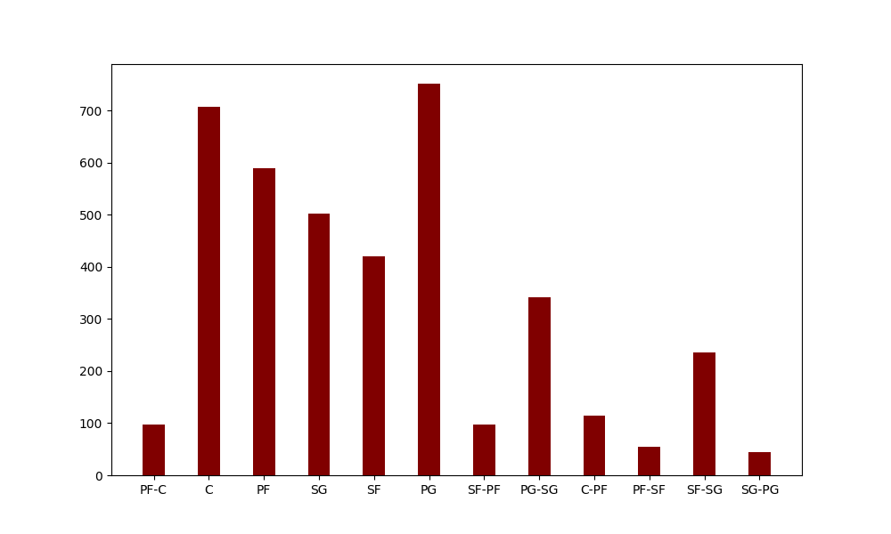
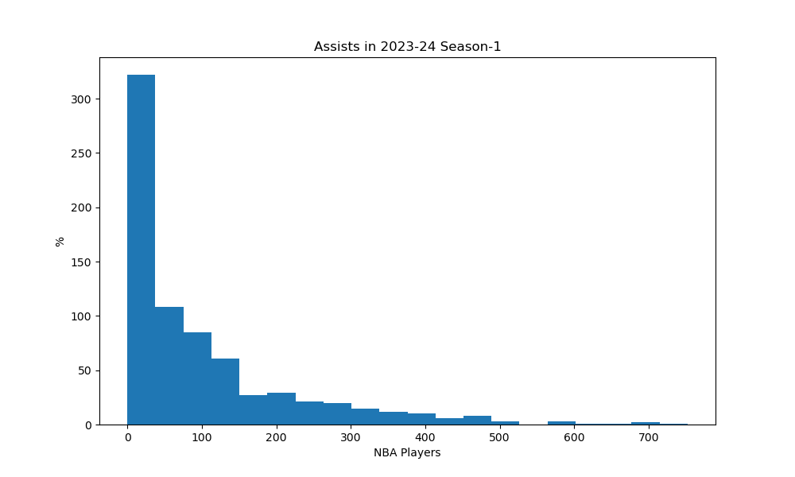

Describe:
|       |      Rk |       Age |        G |       GS |       MP |      FG |      FGA |        FG% |       3P |     3PA |        3P% |      2P |      2PA |        2P% |       eFG% |       FT |     FTA |       FT% |      ORB |     DRB |      TRB |      AST |      STL |      BLK |      TOV |       PF |      PTS |
|:------|--------:|----------:|---------:|---------:|---------:|--------:|---------:|-----------:|---------:|--------:|-----------:|--------:|---------:|-----------:|-----------:|---------:|--------:|----------:|---------:|--------:|---------:|---------:|---------:|---------:|---------:|---------:|---------:|
| count | 735     | 735       | 735      | 735      |  735     | 735     |  735     | 727        | 735      | 735     | 689        | 735     |  735     | 722        | 727        | 735      | 735     | 676       | 735      | 735     |  735     | 735      | 735      | 735      | 735      | 735      |  735     |
| mean  | 282.21  |  26.1551  |  40.8803 |  18.4408 |  907.758 | 156.152 |  330.697 |   0.447558 |  48.0136 | 131.824 |   0.316925 | 108.139 |  198.872 |   0.519686 |   0.515692 |  62.585  |  79.917 |   0.74967 |  39.3986 | 122.627 |  162.026 |  99.8653 |  28.1673 |  19.0871 |  48.019  |  70.5837 |  422.903 |
| std   | 166.859 |   4.37174 |  25.5813 |  25.0241 |  809.499 | 173.95  |  358.161 |   0.110701 |  59.1261 | 154.307 |   0.137217 | 133.627 |  240.132 |   0.136813 |   0.114737 |  88.2262 | 109.342 |   0.16003 |  47.7896 | 132.136 |  174.102 | 124.654  |  27.0038 |  26.7058 |  53.4041 |  61.7233 |  475.814 |
| min   |   1     |  19       |   1      |   0      |    1     |   0     |    0     |   0        |   0      |   0     |   0        |   0     |    0     |   0        |   0        |   0      |   0     |   0       |   0      |   0     |    0     |   0      |   0      |   0      |   0      |   0      |    0     |
| 25%   | 140.5   |  23       |  17      |   0      |  160     |  19     |   47.5   |   0.4      |   2      |  10     |   0.28     |  13     |   26     |   0.47825  |   0.483    |   6      |   9     |   0.6855  |   7      |  19     |   28     |  13      |   5      |   3      |   7      |  15      |   51.5   |
| 50%   | 290     |  25       |  41      |   5      |  680     |  88     |  201     |   0.446    |  22      |  69     |   0.346    |  55     |  107     |   0.53     |   0.529    |  28      |  39     |   0.777   |  23      |  82     |  113     |  54      |  20      |   9      |  30      |  56      |  244     |
| 75%   | 423.5   |  29       |  64.5    |  29      | 1527.5   | 235.5   |  496.5   |   0.5      |  77      | 209.5   |   0.385    | 149.5   |  271.5   |   0.581    |   0.575    |  79      | 104     |   0.84025 |  54      | 183.5   |  241.5   | 130      |  44      |  27      |  69      | 112.5    |  624.5   |
| max   | 572     |  39       |  84      |  82      | 2989     | 837     | 1652     |   0.8      | 357      | 876     |   1        | 803     | 1245     |   1        |   0.917    | 567      | 782     |   1       | 335      | 826     | 1120     | 752      | 150      | 254      | 282      | 254      | 2370     |Summarize:
|    |        0 |
|---:|---------:|
|  0 |  99.8653 |
|  1 |  54      |
|  2 | 124.654  |n

n

Describe:
|       |      Rk |       Age |        G |       GS |       MP |      FG |      FGA |        FG% |       3P |     3PA |        3P% |      2P |      2PA |        2P% |       eFG% |       FT |     FTA |       FT% |      ORB |     DRB |      TRB |      AST |      STL |      BLK |      TOV |       PF |      PTS |
|:------|--------:|----------:|---------:|---------:|---------:|--------:|---------:|-----------:|---------:|--------:|-----------:|--------:|---------:|-----------:|-----------:|---------:|--------:|----------:|---------:|--------:|---------:|---------:|---------:|---------:|---------:|---------:|---------:|
| count | 735     | 735       | 735      | 735      |  735     | 735     |  735     | 727        | 735      | 735     | 689        | 735     |  735     | 722        | 727        | 735      | 735     | 676       | 735      | 735     |  735     | 735      | 735      | 735      | 735      | 735      |  735     |
| mean  | 282.21  |  26.1551  |  40.8803 |  18.4408 |  907.758 | 156.152 |  330.697 |   0.447558 |  48.0136 | 131.824 |   0.316925 | 108.139 |  198.872 |   0.519686 |   0.515692 |  62.585  |  79.917 |   0.74967 |  39.3986 | 122.627 |  162.026 |  99.8653 |  28.1673 |  19.0871 |  48.019  |  70.5837 |  422.903 |
| std   | 166.859 |   4.37174 |  25.5813 |  25.0241 |  809.499 | 173.95  |  358.161 |   0.110701 |  59.1261 | 154.307 |   0.137217 | 133.627 |  240.132 |   0.136813 |   0.114737 |  88.2262 | 109.342 |   0.16003 |  47.7896 | 132.136 |  174.102 | 124.654  |  27.0038 |  26.7058 |  53.4041 |  61.7233 |  475.814 |
| min   |   1     |  19       |   1      |   0      |    1     |   0     |    0     |   0        |   0      |   0     |   0        |   0     |    0     |   0        |   0        |   0      |   0     |   0       |   0      |   0     |    0     |   0      |   0      |   0      |   0      |   0      |    0     |
| 25%   | 140.5   |  23       |  17      |   0      |  160     |  19     |   47.5   |   0.4      |   2      |  10     |   0.28     |  13     |   26     |   0.47825  |   0.483    |   6      |   9     |   0.6855  |   7      |  19     |   28     |  13      |   5      |   3      |   7      |  15      |   51.5   |
| 50%   | 290     |  25       |  41      |   5      |  680     |  88     |  201     |   0.446    |  22      |  69     |   0.346    |  55     |  107     |   0.53     |   0.529    |  28      |  39     |   0.777   |  23      |  82     |  113     |  54      |  20      |   9      |  30      |  56      |  244     |
| 75%   | 423.5   |  29       |  64.5    |  29      | 1527.5   | 235.5   |  496.5   |   0.5      |  77      | 209.5   |   0.385    | 149.5   |  271.5   |   0.581    |   0.575    |  79      | 104     |   0.84025 |  54      | 183.5   |  241.5   | 130      |  44      |  27      |  69      | 112.5    |  624.5   |
| max   | 572     |  39       |  84      |  82      | 2989     | 837     | 1652     |   0.8      | 357      | 876     |   1        | 803     | 1245     |   1        |   0.917    | 567      | 782     |   1       | 335      | 826     | 1120     | 752      | 150      | 254      | 282      | 254      | 2370     |Summarize:
|    |        0 |
|---:|---------:|
|  0 |  99.8653 |
|  1 |  54      |
|  2 | 124.654  |n

n

Describe:
|       |      Rk |       Age |        G |       GS |       MP |      FG |      FGA |        FG% |       3P |     3PA |        3P% |      2P |      2PA |        2P% |       eFG% |       FT |     FTA |       FT% |      ORB |     DRB |      TRB |      AST |      STL |      BLK |      TOV |       PF |      PTS |
|:------|--------:|----------:|---------:|---------:|---------:|--------:|---------:|-----------:|---------:|--------:|-----------:|--------:|---------:|-----------:|-----------:|---------:|--------:|----------:|---------:|--------:|---------:|---------:|---------:|---------:|---------:|---------:|---------:|
| count | 735     | 735       | 735      | 735      |  735     | 735     |  735     | 727        | 735      | 735     | 689        | 735     |  735     | 722        | 727        | 735      | 735     | 676       | 735      | 735     |  735     | 735      | 735      | 735      | 735      | 735      |  735     |
| mean  | 282.21  |  26.1551  |  40.8803 |  18.4408 |  907.758 | 156.152 |  330.697 |   0.447558 |  48.0136 | 131.824 |   0.316925 | 108.139 |  198.872 |   0.519686 |   0.515692 |  62.585  |  79.917 |   0.74967 |  39.3986 | 122.627 |  162.026 |  99.8653 |  28.1673 |  19.0871 |  48.019  |  70.5837 |  422.903 |
| std   | 166.859 |   4.37174 |  25.5813 |  25.0241 |  809.499 | 173.95  |  358.161 |   0.110701 |  59.1261 | 154.307 |   0.137217 | 133.627 |  240.132 |   0.136813 |   0.114737 |  88.2262 | 109.342 |   0.16003 |  47.7896 | 132.136 |  174.102 | 124.654  |  27.0038 |  26.7058 |  53.4041 |  61.7233 |  475.814 |
| min   |   1     |  19       |   1      |   0      |    1     |   0     |    0     |   0        |   0      |   0     |   0        |   0     |    0     |   0        |   0        |   0      |   0     |   0       |   0      |   0     |    0     |   0      |   0      |   0      |   0      |   0      |    0     |
| 25%   | 140.5   |  23       |  17      |   0      |  160     |  19     |   47.5   |   0.4      |   2      |  10     |   0.28     |  13     |   26     |   0.47825  |   0.483    |   6      |   9     |   0.6855  |   7      |  19     |   28     |  13      |   5      |   3      |   7      |  15      |   51.5   |
| 50%   | 290     |  25       |  41      |   5      |  680     |  88     |  201     |   0.446    |  22      |  69     |   0.346    |  55     |  107     |   0.53     |   0.529    |  28      |  39     |   0.777   |  23      |  82     |  113     |  54      |  20      |   9      |  30      |  56      |  244     |
| 75%   | 423.5   |  29       |  64.5    |  29      | 1527.5   | 235.5   |  496.5   |   0.5      |  77      | 209.5   |   0.385    | 149.5   |  271.5   |   0.581    |   0.575    |  79      | 104     |   0.84025 |  54      | 183.5   |  241.5   | 130      |  44      |  27      |  69      | 112.5    |  624.5   |
| max   | 572     |  39       |  84      |  82      | 2989     | 837     | 1652     |   0.8      | 357      | 876     |   1        | 803     | 1245     |   1        |   0.917    | 567      | 782     |   1       | 335      | 826     | 1120     | 752      | 150      | 254      | 282      | 254      | 2370     |Summarize:
|    |        0 |
|---:|---------:|
|  0 |  99.8653 |
|  1 |  54      |
|  2 | 124.654  |n

n

Describe:
|       |      Rk |       Age |        G |       GS |       MP |      FG |      FGA |        FG% |       3P |     3PA |        3P% |      2P |      2PA |        2P% |       eFG% |       FT |     FTA |       FT% |      ORB |     DRB |      TRB |      AST |      STL |      BLK |      TOV |       PF |      PTS |
|:------|--------:|----------:|---------:|---------:|---------:|--------:|---------:|-----------:|---------:|--------:|-----------:|--------:|---------:|-----------:|-----------:|---------:|--------:|----------:|---------:|--------:|---------:|---------:|---------:|---------:|---------:|---------:|---------:|
| count | 735     | 735       | 735      | 735      |  735     | 735     |  735     | 727        | 735      | 735     | 689        | 735     |  735     | 722        | 727        | 735      | 735     | 676       | 735      | 735     |  735     | 735      | 735      | 735      | 735      | 735      |  735     |
| mean  | 282.21  |  26.1551  |  40.8803 |  18.4408 |  907.758 | 156.152 |  330.697 |   0.447558 |  48.0136 | 131.824 |   0.316925 | 108.139 |  198.872 |   0.519686 |   0.515692 |  62.585  |  79.917 |   0.74967 |  39.3986 | 122.627 |  162.026 |  99.8653 |  28.1673 |  19.0871 |  48.019  |  70.5837 |  422.903 |
| std   | 166.859 |   4.37174 |  25.5813 |  25.0241 |  809.499 | 173.95  |  358.161 |   0.110701 |  59.1261 | 154.307 |   0.137217 | 133.627 |  240.132 |   0.136813 |   0.114737 |  88.2262 | 109.342 |   0.16003 |  47.7896 | 132.136 |  174.102 | 124.654  |  27.0038 |  26.7058 |  53.4041 |  61.7233 |  475.814 |
| min   |   1     |  19       |   1      |   0      |    1     |   0     |    0     |   0        |   0      |   0     |   0        |   0     |    0     |   0        |   0        |   0      |   0     |   0       |   0      |   0     |    0     |   0      |   0      |   0      |   0      |   0      |    0     |
| 25%   | 140.5   |  23       |  17      |   0      |  160     |  19     |   47.5   |   0.4      |   2      |  10     |   0.28     |  13     |   26     |   0.47825  |   0.483    |   6      |   9     |   0.6855  |   7      |  19     |   28     |  13      |   5      |   3      |   7      |  15      |   51.5   |
| 50%   | 290     |  25       |  41      |   5      |  680     |  88     |  201     |   0.446    |  22      |  69     |   0.346    |  55     |  107     |   0.53     |   0.529    |  28      |  39     |   0.777   |  23      |  82     |  113     |  54      |  20      |   9      |  30      |  56      |  244     |
| 75%   | 423.5   |  29       |  64.5    |  29      | 1527.5   | 235.5   |  496.5   |   0.5      |  77      | 209.5   |   0.385    | 149.5   |  271.5   |   0.581    |   0.575    |  79      | 104     |   0.84025 |  54      | 183.5   |  241.5   | 130      |  44      |  27      |  69      | 112.5    |  624.5   |
| max   | 572     |  39       |  84      |  82      | 2989     | 837     | 1652     |   0.8      | 357      | 876     |   1        | 803     | 1245     |   1        |   0.917    | 567      | 782     |   1       | 335      | 826     | 1120     | 752      | 150      | 254      | 282      | 254      | 2370     |Summarize:
|    |        0 |
|---:|---------:|
|  0 |  99.8653 |
|  1 |  54      |
|  2 | 124.654  |n

n

Describe:
|       |      Rk |       Age |        G |       GS |       MP |      FG |      FGA |        FG% |       3P |     3PA |        3P% |      2P |      2PA |        2P% |       eFG% |       FT |     FTA |       FT% |      ORB |     DRB |      TRB |      AST |      STL |      BLK |      TOV |       PF |      PTS |
|:------|--------:|----------:|---------:|---------:|---------:|--------:|---------:|-----------:|---------:|--------:|-----------:|--------:|---------:|-----------:|-----------:|---------:|--------:|----------:|---------:|--------:|---------:|---------:|---------:|---------:|---------:|---------:|---------:|
| count | 735     | 735       | 735      | 735      |  735     | 735     |  735     | 727        | 735      | 735     | 689        | 735     |  735     | 722        | 727        | 735      | 735     | 676       | 735      | 735     |  735     | 735      | 735      | 735      | 735      | 735      |  735     |
| mean  | 282.21  |  26.1551  |  40.8803 |  18.4408 |  907.758 | 156.152 |  330.697 |   0.447558 |  48.0136 | 131.824 |   0.316925 | 108.139 |  198.872 |   0.519686 |   0.515692 |  62.585  |  79.917 |   0.74967 |  39.3986 | 122.627 |  162.026 |  99.8653 |  28.1673 |  19.0871 |  48.019  |  70.5837 |  422.903 |
| std   | 166.859 |   4.37174 |  25.5813 |  25.0241 |  809.499 | 173.95  |  358.161 |   0.110701 |  59.1261 | 154.307 |   0.137217 | 133.627 |  240.132 |   0.136813 |   0.114737 |  88.2262 | 109.342 |   0.16003 |  47.7896 | 132.136 |  174.102 | 124.654  |  27.0038 |  26.7058 |  53.4041 |  61.7233 |  475.814 |
| min   |   1     |  19       |   1      |   0      |    1     |   0     |    0     |   0        |   0      |   0     |   0        |   0     |    0     |   0        |   0        |   0      |   0     |   0       |   0      |   0     |    0     |   0      |   0      |   0      |   0      |   0      |    0     |
| 25%   | 140.5   |  23       |  17      |   0      |  160     |  19     |   47.5   |   0.4      |   2      |  10     |   0.28     |  13     |   26     |   0.47825  |   0.483    |   6      |   9     |   0.6855  |   7      |  19     |   28     |  13      |   5      |   3      |   7      |  15      |   51.5   |
| 50%   | 290     |  25       |  41      |   5      |  680     |  88     |  201     |   0.446    |  22      |  69     |   0.346    |  55     |  107     |   0.53     |   0.529    |  28      |  39     |   0.777   |  23      |  82     |  113     |  54      |  20      |   9      |  30      |  56      |  244     |
| 75%   | 423.5   |  29       |  64.5    |  29      | 1527.5   | 235.5   |  496.5   |   0.5      |  77      | 209.5   |   0.385    | 149.5   |  271.5   |   0.581    |   0.575    |  79      | 104     |   0.84025 |  54      | 183.5   |  241.5   | 130      |  44      |  27      |  69      | 112.5    |  624.5   |
| max   | 572     |  39       |  84      |  82      | 2989     | 837     | 1652     |   0.8      | 357      | 876     |   1        | 803     | 1245     |   1        |   0.917    | 567      | 782     |   1       | 335      | 826     | 1120     | 752      | 150      | 254      | 282      | 254      | 2370     |Summarize:
|    |        0 |
|---:|---------:|
|  0 |  99.8653 |
|  1 |  54      |
|  2 | 124.654  |n

n

